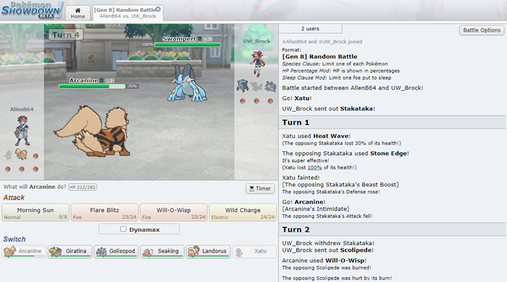

# Reinforcement Learning in Pokémon Showdown

# About Project
This project is to train and test different `keras-rl` agents on Pokémon Showdown using `poke-env`. The main file used for training and testing is `rl_testing.py`.

# Getting started

## Installation
1. Clone the repo.
   - `git clone git@github.com:scbrock/pokemon_project.git`
2. Install Python requirements
   - `pip install -r requirements.txt`

## Running
To run a sample train/test iteration, use the following command:
`python3 rl_testing.py >| output.txt`
The rationale behind redirecting the output to `output.txt` is because the program encounters a lot warnings upon execution. Do not be alarmed if you see this while running the file.

# Useful Links
- `poke-env` - https://poke-env.readthedocs.io/en/stable/
- `Pokemon Showdown` - https://pokemonshowdown.com/
